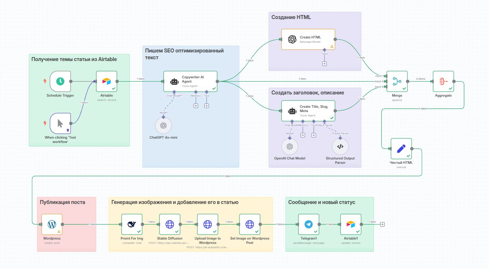

# Автоматизированная публикация SEO-статей в WordPress

## 📌 Обзор решения
Полностью автоматизированный процесс создания и публикации SEO-оптимизированных статей с помощью ИИ и n8n.

---

## 🖼️ Скриншоты работы системы

### 1. Контент-план в Airtable
#### **Планирование**  
   - Настраиваете контент-план в Airtable
   - Задаёте параметры статей (ключевые слова, тон, структуру)

.jpg)  
*Управление темами и параметрами статей через Airtable таблицу*

### 2. Готовая статья в WordPress
#### **Генерация и Публикация**  
   - Система автоматически:
     - Создаёт SEO-оптимизированный текст через GPT-4
     - Форматирует контент в HTML
     - Генерирует мета-теги
   - Статья публикуется в WordPress:
     - По расписанию
     - Или по вашему запросу

.jpg)  
*Автоматически сгенерированная и отформатированная статья на блоге*

### 3. Уведомление в Telegram
  - Вы получаете подтверждение в Telegram
  
.jpg)  
*Автоматическое оповещение об успешной публикации*

### 4. Схема рабочего процесса
  
*Полная схема автоматизации в n8n*

